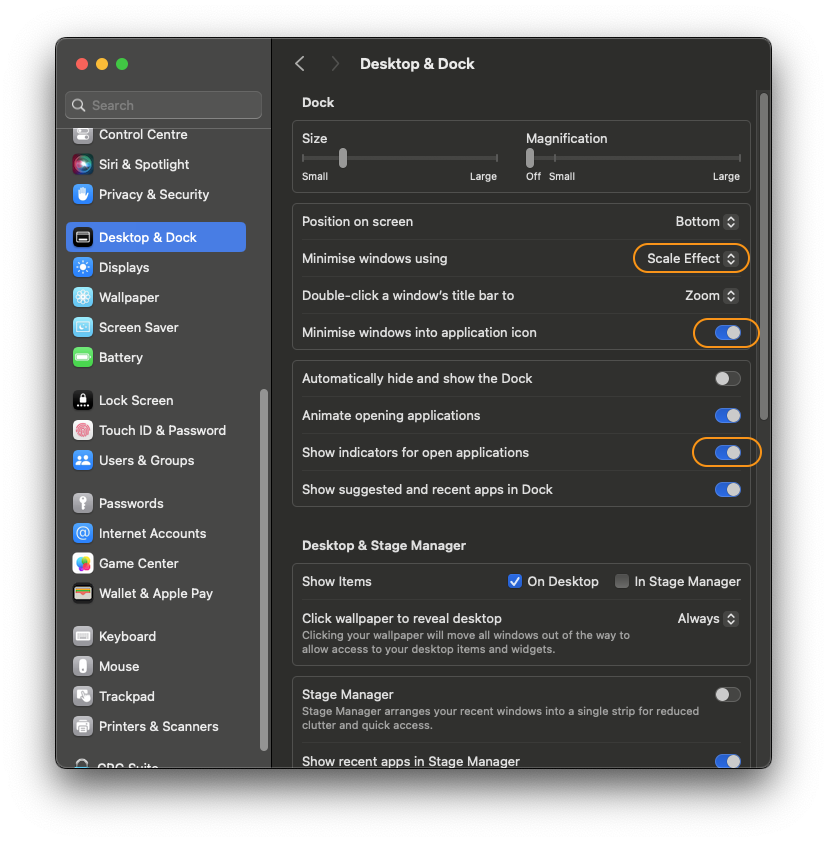
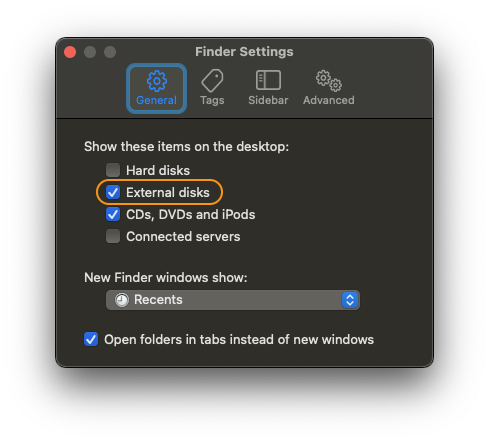
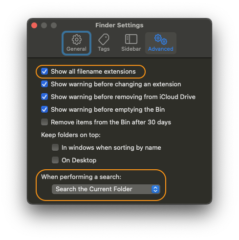
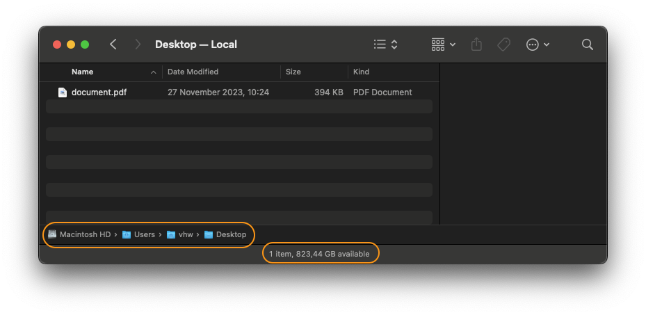
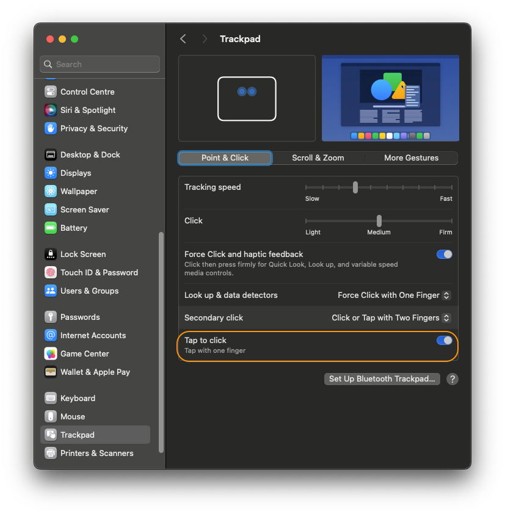
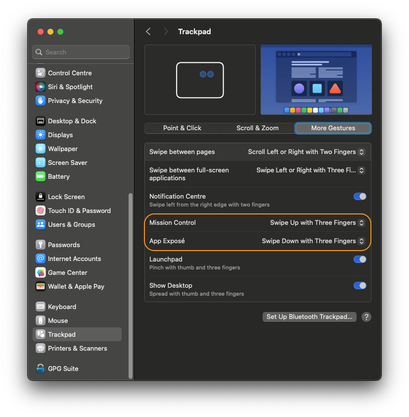
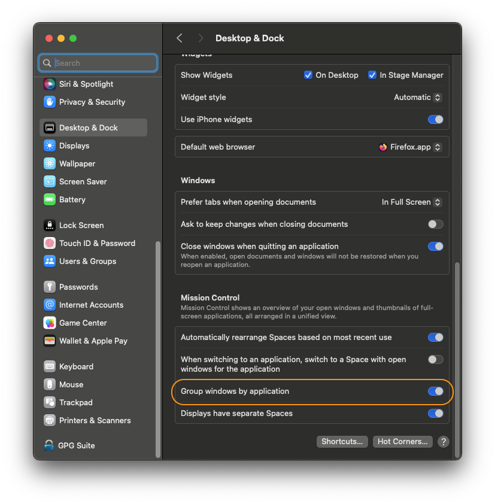
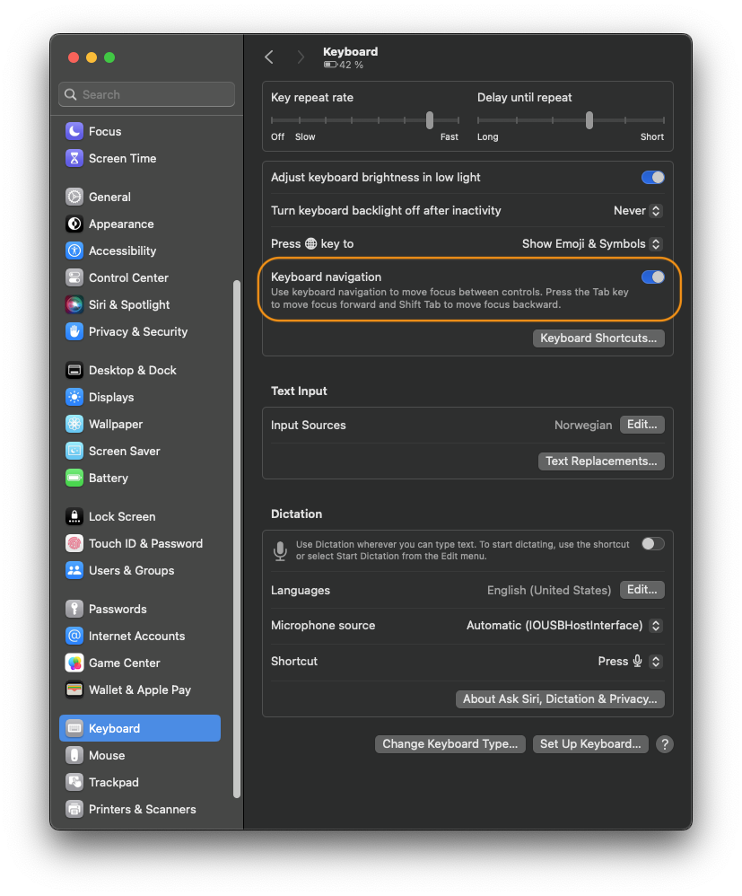

# Basic configuration

A fresh new installation of macOS with its defaults will serve you quite well but still there are some essential adjustments and configuration steps that I always go through. This is my list based on my personal preference.

## The Dock

I find the default dock settings a bit messy and distractive but the three settings below will make it more clean and intuitive.

| Setting name                           | Value        | Comment                                                                                                                                                                                 |
| -------------------------------------- | ------------ | --------------------------------------------------------------------------------------------------------------------------------------------------------------------------------------- |
| Minimise windows using                 | Scale Effect | The "Scale Effect" setting is much more smooth vs the "Genie Effect". It is faster and less distractive.                                                                                |
| Minimise windows into application icon | On           | Minimise the application windows into and group them with the application dock icon. More clean and does not add all the individual windows icons all the way to the right on the dock. |
| Show indicators for open applications  | On           | Show a little dot under each dock application icon that is active.                                                                                                                      |

## Finder

The default settings of Finder are too "dumbed down" and stripped. I want more information available at all times.

In Finder Settings General tab I want to show the External disk icons on the Desktop in addition to the Sidebar:

In the Advanced tab the "Show all filename extensions" is the most important to change. It will always show the file extension even with the known file type such as PDF.

Also, I find it more convenient to perform Spotlight searches within the same folder vs "everything" across macOS.

You can also show more info at the bottom of each Finder window like the Status bar and Path bar. Both options are available from the Finder View menu.

## Gestures

The "tap to click" set to "on" is my preferred choice. You can still do the full click by pressing.

I use Mission Control and App Exposé all the time to manage my screens and windows effectively. No matter how many active windows and dialog prompts are open, these tools just work seamlessly. One of the classic complaints or questions from first-time Windows users on macOS is, "Where did my app window go?" Mission Control helps with that. It has a dedicated button on the keyboard (F3), but you can also activate it with the Control + Arrow key combination or by swiping up with three fingers on the trackpad.

App Exposé is the same thing but only with your active/focused application windows and dialog prompts. Run it by pressing the Control + Arrow down key combo or perform the three fingers swipe down trackpad gesture.

Another important setting to make Mission Control application overview even more useful is "Group windows by application".

## Other settings

Keyboard navigation is another handy feature that should be 'on' by default. Why would you not prefer the option to use 'tab' to move around in a dialog window?

